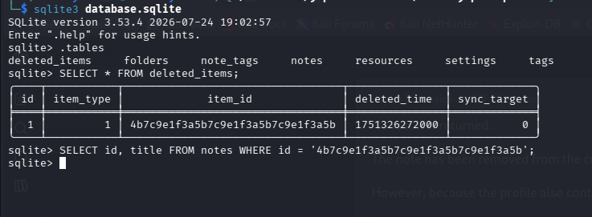
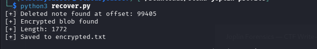
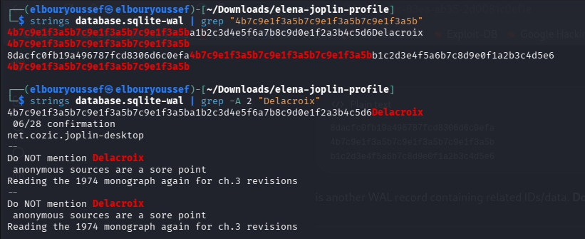
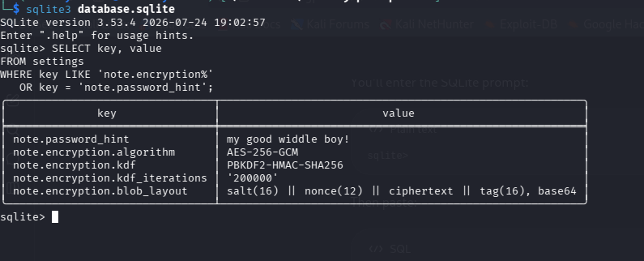
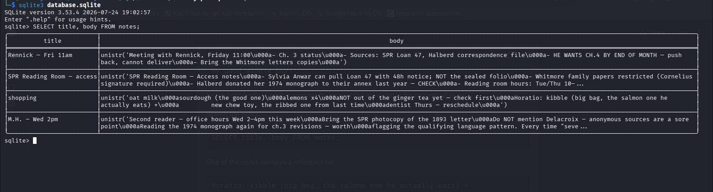
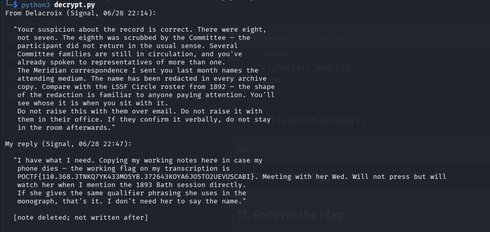

# 🔎 Joplin Forensics --- CTF Write-up

> **Category:** Digital Forensics / SQLite\
> **Difficulty:** Beginner / Intermediate\
> **Target:** Joplin Desktop\
> **Techniques:** SQLite, WAL analysis, deleted data recovery, password
> discovery, PBKDF2, AES-256-GCM

------------------------------------------------------------------------

## 📌 Challenge Description

We are given a Joplin profile containing:

``` text
database.sqlite
database.sqlite-wal
database.sqlite-shm
```

The challenge tells us that an entry was deleted and asks us to recover
it.

The key clue is:

> "If something was deleted, where did it go before it was truly gone?"

This suggests investigating the SQLite **Write-Ahead Log (WAL)**.

------------------------------------------------------------------------

# 1. Inspect the SQLite Database

First, open the database:

``` bash
sqlite3 database.sqlite
```

List the tables:

``` sql
.tables
```

The interesting table is:

``` text
deleted_items
```

Query it:

``` sql
SELECT * FROM deleted_items;
```

This gives the deleted note ID:

``` text
4b7c9e1f3a5b7c9e1f3a5b7c9e1f3a5b
```



------------------------------------------------------------------------

# 2. Check if the Deleted Note Still Exists

Search the `notes` table:

``` sql
SELECT id, title
FROM notes
WHERE id = '4b7c9e1f3a5b7c9e1f3a5b7c9e1f3a5b';
```

There is no result, meaning the note is no longer present in the current
database state.

However, the profile also contains:

``` text
database.sqlite-wal
```

So we investigate the WAL.


------------------------------------------------------------------------

# 3. Investigate the SQLite WAL

SQLite WAL files can retain previous database changes before
checkpointing.

Search the WAL for the deleted note ID:

``` bash
strings database.sqlite-wal | grep "4b7c9e1f3a5b7c9e1f3a5b7c9e1f3a5b"
```

The output contains the deleted note title:

``` text
Delacroix — 06/28 confirmation
```

This confirms that the deleted record is still present in the WAL.



------------------------------------------------------------------------

# 4. Recover the Encrypted Data

I used a small Python script to locate the recovered note and extract
its encrypted blob.

### `recover.py`

``` python
from pathlib import Path
import re

wal = Path("database.sqlite-wal").read_bytes()

title = b"Delacroix \xe2\x80\x94 06/28 confirmation"

pos = wal.find(title)

if pos == -1:
    print("[-] Deleted note not found")
    exit()

print("[+] Deleted note found at offset:", pos)

data = wal[pos + len(title):pos + len(title) + 5000]

match = re.search(rb'[A-Za-z0-9+/=]{100,}', data)

if not match:
    print("[-] Encrypted blob not found")
    exit()

blob = match.group().decode()

print("[+] Encrypted blob found")
print("[+] Length:", len(blob))

with open("encrypted.txt", "w") as f:
    f.write(blob)

print("[+] Saved to encrypted.txt")
```

Running:

``` bash
python3 recover.py
```

produced:

``` text
[+] Deleted note found at offset: 99405
[+] Encrypted blob found
[+] Length: 1772
[+] Saved to encrypted.txt
```



------------------------------------------------------------------------

# 5. Identify the Encryption Scheme

Query the Joplin `settings` table:

``` sql
SELECT key, value
FROM settings
WHERE key LIKE 'note.encryption%'
   OR key = 'note.password_hint';
```

The important settings are:

``` text
note.password_hint              | my good widdle boy!
note.encryption.algorithm       | AES-256-GCM
note.encryption.kdf             | PBKDF2-HMAC-SHA256
note.encryption.kdf_iterations  | 200000
note.encryption.blob_layout     | salt(16) || nonce(12) || ciphertext || tag(16), base64
```

So the encrypted blob uses:

``` text
salt (16 bytes)
+
nonce (12 bytes)
+
ciphertext
+
authentication tag (16 bytes)
```

The complete structure is Base64 encoded.



------------------------------------------------------------------------

# 6. Find the Password

The password hint is:

``` text
my good widdle boy!
```

I searched the existing notes for contextual clues.

One note contains:

``` text
Horatio: kibble (big bag, the salmon one he actually eats) +
new chew toy, the ribbed one from last time
```

The "good boy" clue points to:

``` text
Horatio
```

Therefore:

``` text
password = horatio
```



------------------------------------------------------------------------

# 7. Derive the Encryption Key

The encryption configuration specifies:

``` text
PBKDF2-HMAC-SHA256
200000 iterations
32-byte key
```

First, decode the Base64 blob:

``` python
import base64

data = base64.b64decode(blob)
```

Extract the components:

``` python
salt = data[:16]
nonce = data[16:28]
ciphertext_and_tag = data[28:]
```

Then derive the AES-256 key:

``` python
import hashlib

key = hashlib.pbkdf2_hmac(
    "sha256",
    b"horatio",
    salt,
    200000,
    32
)
```

------------------------------------------------------------------------

# 8. Decrypt the Note

The encryption algorithm is:

``` text
AES-256-GCM
```

Decrypt with:

``` python
from cryptography.hazmat.primitives.ciphers.aead import AESGCM

plaintext = AESGCM(key).decrypt(
    nonce,
    ciphertext_and_tag,
    None
)

print(plaintext.decode())
```

A complete `decrypt.py`:

``` python
import base64
import hashlib

from cryptography.hazmat.primitives.ciphers.aead import AESGCM

with open("encrypted.txt", "r") as f:
    blob = f.read().strip()

data = base64.b64decode(blob)

salt = data[:16]
nonce = data[16:28]
ciphertext_and_tag = data[28:]

password = b"horatio"

key = hashlib.pbkdf2_hmac(
    "sha256",
    password,
    salt,
    200000,
    32
)

plaintext = AESGCM(key).decrypt(
    nonce,
    ciphertext_and_tag,
    None
)

print(plaintext.decode())
```

Running:

``` bash
python3 decrypt.py
```

successfully decrypts the deleted note.



------------------------------------------------------------------------

# 9. Recover the Flag

The decrypted note contains a Signal conversation with the recovered
working flag:

``` text
POCTF{110.368.3TNKQ7YK433MO5YB.372643KOYA6JO5TO2UEVUSCABI}
```


------------------------------------------------------------------------

# 🏁 Final Flag

``` text
POCTF{110.368.3TNKQ7YK433MO5YB.372643KOYA6JO5TO2UEVUSCABI}
```

------------------------------------------------------------------------

# 🧠 Lessons Learned

### SQLite deletion does not necessarily mean data is gone

When SQLite uses WAL mode, previous database changes can remain in:

``` text
database.sqlite-wal
```

### Preserve the SQLite files

For forensic analysis, keep these together:

``` text
database.sqlite
database.sqlite-wal
database.sqlite-shm
```

Opening or modifying the database can cause SQLite to checkpoint the WAL
and potentially remove useful forensic evidence.

### Look for application-specific configuration

The `settings` table revealed:

``` text
AES-256-GCM
PBKDF2-HMAC-SHA256
200000 iterations
```

### Correlate information between records

The password was not directly written in the deleted note:

``` text
"my good widdle boy!"
          ↓
     good boy clue
          ↓
       Horatio
          ↓
    password = horatio
```

This demonstrates why forensic investigations require correlation, not
just keyword searching.

------------------------------------------------------------------------

# 🛠️ Tools Used

-   `sqlite3`
-   `strings`
-   Python 3
-   `hashlib`
-   `base64`
-   `cryptography`
-   SQLite WAL analysis

------------------------------------------------------------------------

# 📂 Repository Structure

``` text
.
├── README.md
├── recover.py
├── decrypt.py
├── img1.png
├── img2.png
├── img3.png
├── img4.png
├── img5.png
└── img6.png
```

------------------------------------------------------------------------

## Author

CTF write-up by **Youssef EL Bour**.
